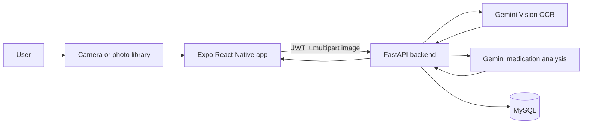

# Prescription Vision and Text Extraction

This document explains how Eunoia captures a prescription photo, sends it to
the backend, extracts the written text with Google Gemini Vision, analyzes the
medicines, and displays the result in the mobile app.

It is written as a handoff guide for anyone who needs to understand, run, or
modify this feature.

> **Medical safety:** This feature is an information-extraction prototype. OCR
> and AI output can be wrong. It must not be used to diagnose a condition or
> replace a doctor's or pharmacist's instructions.

## What the feature does

1. The user scans a prescription with the camera or chooses an existing photo.
2. The Expo app sends the image as a `multipart/form-data` request.
3. FastAPI checks the authenticated user and validates that the upload is an image.
4. Gemini Vision reads the visible prescription text.
5. Gemini analyzes the extracted text and returns medication information as JSON.
6. The backend compares the result with the user's recorded allergies and medicines.
7. The analysis is saved in MySQL.
8. The backend returns the result to the app, which shows the dosage, timing,
   purpose, warnings, advice, and extracted text.



## Important files

| File | Responsibility |
| --- | --- |
| [`frontend/app/(tabs)/prescriptions.tsx`](./frontend/app/(tabs)/prescriptions.tsx) | Requests camera/photo permissions, captures or selects the image, starts the upload, and displays the result. |
| [`frontend/utils/api.ts`](./frontend/utils/api.ts) | Builds the multipart request and calls `POST /api/prescriptions/upload`. |
| [`backend/server.py`](./backend/server.py) | Defines Gemini configuration, OCR, prescription analysis, API routes, and database persistence. |
| [`backend/profile_context.py`](./backend/profile_context.py) | Loads allergies, current medicines, and other health-profile context for the AI prompt. |
| [`backend/requirements.txt`](./backend/requirements.txt) | Contains the Gemini, FastAPI, multipart-upload, and image dependencies. |

## Prerequisites

- Python 3.11 or newer
- Node.js and npm
- MySQL
- A Gemini API key
- A phone/emulator with camera access, or a browser for photo-library testing

Install the backend dependencies:

```powershell
cd backend
.\venv\Scripts\Activate.ps1
pip install -r requirements.txt
```

Install the frontend dependencies:

```powershell
cd frontend
npm install
```

## Environment configuration

Create `backend/.env`:

```env
GEMINI_API_KEY=your_gemini_api_key
GEMINI_MODEL=gemini-1.5-flash

MYSQL_HOST=localhost
MYSQL_PORT=3306
MYSQL_DB=health_assistant
MYSQL_USER=root
MYSQL_PASSWORD=your_mysql_password

JWT_SECRET=replace-with-a-long-random-secret
```

For a physical phone, configure the mobile app to use the computer's LAN
address in `frontend/.env`:

```env
EXPO_PUBLIC_BACKEND_URL=http://192.168.1.100:8000
```

Replace the example IP address with the development computer's local IP.
The phone and computer must be connected to the same network.

## Frontend: capture and upload

The screen uses `expo-image-picker` for both camera capture and photo-library
selection:

```tsx
const pickImage = async (source: 'camera' | 'library') => {
  const permission =
    source === 'camera'
      ? await ImagePicker.requestCameraPermissionsAsync()
      : await ImagePicker.requestMediaLibraryPermissionsAsync();

  if (!permission.granted) {
    Alert.alert(
      'Permission needed',
      'Allow access before selecting a prescription image.',
    );
    return;
  }

  const result =
    source === 'camera'
      ? await ImagePicker.launchCameraAsync({
          mediaTypes: ['images'],
          allowsEditing: true,
          quality: 0.8,
        })
      : await ImagePicker.launchImageLibraryAsync({
          mediaTypes: ['images'],
          allowsEditing: true,
          quality: 0.8,
        });

  if (!result.canceled && result.assets[0]) {
    await handleUpload(result.assets[0].uri);
  }
};
```

`frontend/utils/api.ts` converts the selected URI into a multipart upload:

```tsx
const formData = new FormData();

if (Platform.OS === 'web') {
  const blob = await (await fetch(imageUri)).blob();
  formData.append('file', blob, 'prescription.jpg');
} else {
  formData.append('file', {
    uri: imageUri,
    name: 'prescription.jpg',
    type: 'image/jpeg',
  } as any);
}

const response = await fetch(
  `${API_BASE_URL}/api/prescriptions/upload`,
  {
    method: 'POST',
    headers: {
      Authorization: `Bearer ${token}`,
    },
    body: formData,
  },
);
```

Do not manually set the `Content-Type` header. `fetch` adds the multipart
boundary automatically.

## Backend: Gemini Vision OCR

Gemini is configured when the backend starts:

```python
GEMINI_API_KEY = os.environ.get("GEMINI_API_KEY")
GEMINI_MODEL = os.environ.get(
    "GEMINI_MODEL",
    "gemini-1.5-flash",
)

if GEMINI_API_KEY:
    genai.configure(api_key=GEMINI_API_KEY)
```

The OCR function in `backend/server.py` sends the image bytes to Gemini as
base64 inline image data:

```python
async def extract_text_from_image(image_data: bytes) -> str:
    image_base64 = base64.b64encode(image_data).decode("utf-8")

    model = genai.GenerativeModel(
        model_name=GEMINI_MODEL
    )

    prompt = """
Extract all visible text from this prescription image exactly as written.

Include medication names, dosages, doctor instructions, frequencies,
timing information, and any other visible text.

Return only the extracted text.
"""

    response = await model.generate_content_async(
        [
            prompt,
            {
                "inline_data": {
                    "mime_type": "image/jpeg",
                    "data": image_base64,
                }
            },
        ]
    )

    extracted_text = (response.text or "").strip()

    if len(extracted_text) < 10:
        raise HTTPException(
            status_code=400,
            detail="Could not extract sufficient text from image.",
        )

    return extracted_text
```

The prompt asks Gemini to transcribe the image first. Medication interpretation
is handled in a second AI call so the original extracted text can be retained
and shown to the user.

## Backend: medication analysis

After OCR, `analyze_prescription_with_ai()` sends the extracted text and the
user's health context to Gemini:

```python
prompt = f"""
Prescription text:
{extracted_text}

Analyze the prescription and return only valid JSON:

{{
  "medications": [
    {{
      "medication_name": "",
      "dosage": "",
      "frequency": "",
      "timing": "",
      "purpose": "",
      "side_effects": "",
      "interactions": "",
      "personalized_advice": ""
    }}
  ],
  "general_advice": ""
}}

Compare the medicines with the user's recorded allergies and
current medications. Do not diagnose the user or tell them to
start, stop, or change a medicine.
"""
```

The backend converts the returned medication list into the fields used by the
mobile UI:

- Medication name
- Dosage
- Frequency
- Timing
- Purpose
- Side effects
- Interactions and warnings
- Personalized advice
- Original extracted text

The backend also performs a deterministic allergy-conflict check after the AI
response. This is a safety backstop that can add warnings; it does not prove
that a prescription is safe.

## API endpoint

### `POST /api/prescriptions/upload`

Authentication:

```http
Authorization: Bearer <jwt-token>
```

Request:

```http
Content-Type: multipart/form-data
file=<prescription image>
```

Successful response:

```json
{
  "id": "12",
  "user_id": "3",
  "medication_name": "Example medicine",
  "dosage": "500 mg",
  "frequency": "Twice daily",
  "timing": "After meals",
  "purpose": "Information returned by Gemini",
  "side_effects": "Information returned by Gemini",
  "interactions": "Warnings returned by Gemini or the allergy check",
  "personalized_advice": "Safety-focused guidance",
  "extracted_text": "Text read from the prescription image",
  "ai_analysis": "The original AI analysis",
  "created_at": "2026-09-24T15:30:00"
}
```

The app also uses:

- `GET /api/prescriptions/history?limit=20`
- `GET /api/prescriptions/{prescription_id}`

All prescription routes require the same JWT authentication.

## Database storage

The backend creates the `prescriptions` table during startup:

```sql
CREATE TABLE IF NOT EXISTS prescriptions (
    id INT AUTO_INCREMENT PRIMARY KEY,
    user_id INT NOT NULL,
    image_path VARCHAR(512) NULL,
    extracted_text LONGTEXT NOT NULL,
    medication_name TEXT NULL,
    dosage TEXT NULL,
    frequency TEXT NULL,
    timing TEXT NULL,
    purpose TEXT NULL,
    side_effects TEXT NULL,
    interactions TEXT NULL,
    personalized_advice LONGTEXT NULL,
    ai_analysis LONGTEXT NOT NULL,
    created_at DATETIME NOT NULL,
    FOREIGN KEY (user_id)
        REFERENCES users(id)
        ON DELETE CASCADE
);
```

The image itself is not currently stored in the database. The extracted text
and AI analysis are stored so the user can view the result later.

## Running the feature locally

Start MySQL, then start the backend:

```powershell
cd backend
.\venv\Scripts\Activate.ps1
.\run.ps1
```

In another terminal, start Expo:

```powershell
cd frontend
npm start
```

Then:

1. Open the app.
2. Register or log in.
3. Open **Prescriptions**.
4. Select **Scan prescription** or **Choose from photos**.
5. Upload a clear, well-lit image.
6. Wait for OCR and analysis to complete.
7. Open the saved prescription to inspect the extracted text and guidance.

## Testing and troubleshooting

Run backend tests:

```powershell
cd backend
.\venv\Scripts\Activate.ps1
pytest
```

Check the backend health endpoint:

```text
http://localhost:8000/api/health
```

If the upload fails, check:

- `GEMINI_API_KEY` exists in `backend/.env`.
- The backend was restarted after changing `.env`.
- MySQL is running and the credentials are correct.
- The phone and backend computer are on the same Wi-Fi.
- The image is a clear JPEG or PNG.
- The JWT token is valid.
- The selected Gemini model is available for the API key.

Common local URLs:

| Device | Backend URL |
| --- | --- |
| Desktop browser | `http://localhost:8000` |
| Android emulator | `http://10.0.2.2:8000` |
| Physical phone | `http://<computer-lan-ip>:8000` |

## Current limitations

- Handwritten prescriptions may be difficult to read.
- Blurry, dark, tilted, or cropped images reduce OCR accuracy.
- Gemini may misread a medicine name or invent details when the prescription
  does not contain enough information.
- The current database stores the extracted text and analysis, not the original
  image.
- The feature is not clinically validated.
- Gemini availability, quota, and pricing depend on the configured Google AI
  account and model.

Always tell users to verify the result with the original prescription and a
qualified healthcare professional.
