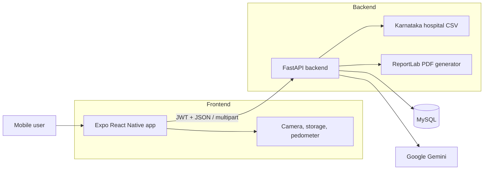
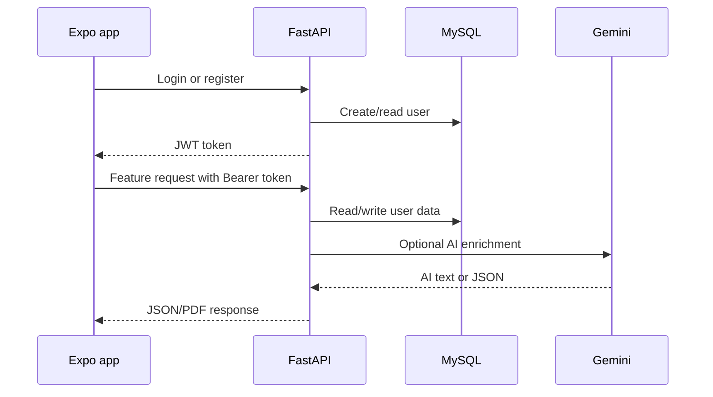
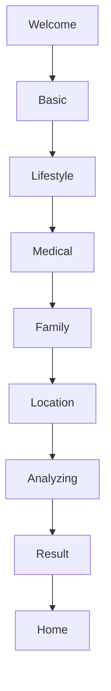
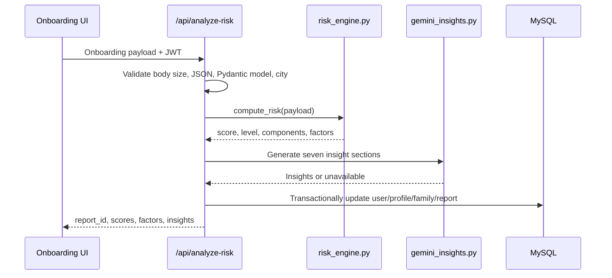
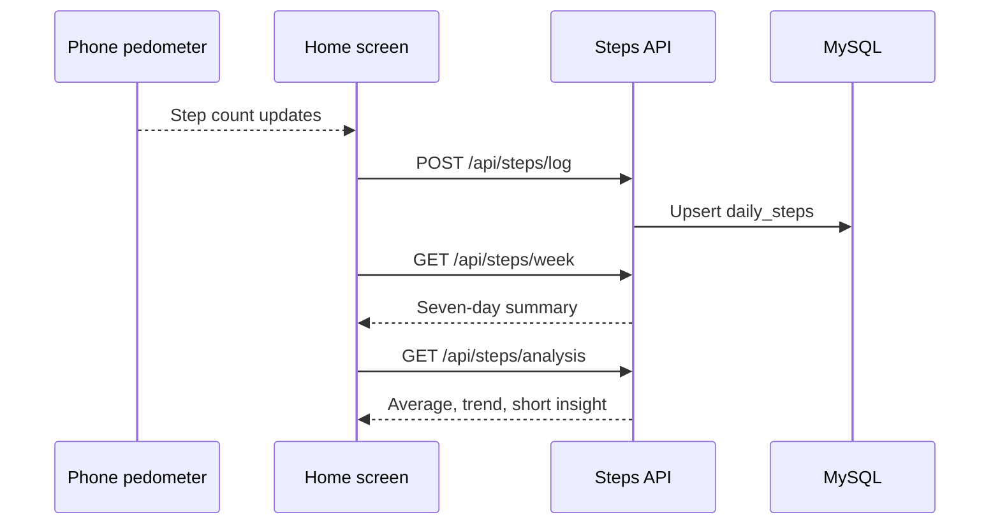
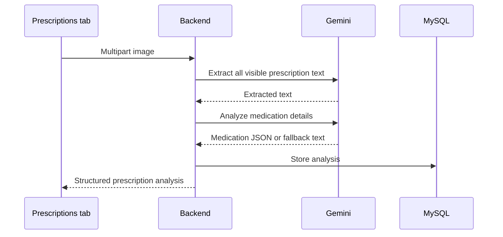
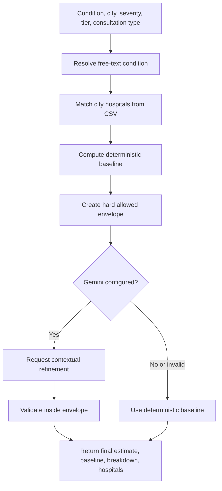
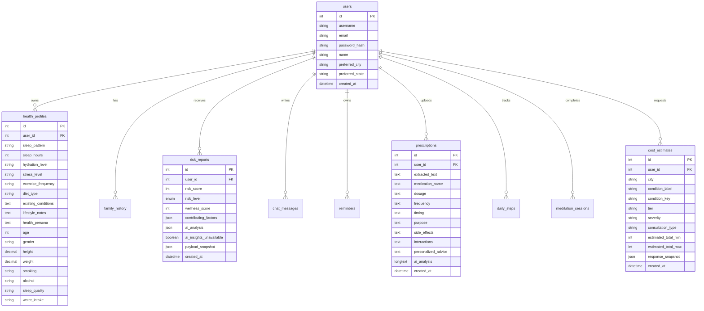

# Eunoia

Eunoia is a full-stack preventive health assistant built as an Expo React Native mobile app with a FastAPI backend. It supports account creation, health onboarding, deterministic risk scoring, Gemini-powered preventive insights, prescription image analysis, AI chat, step and meditation tracking, health-report PDF generation, and a Karnataka-focused medical cost estimator.

This repository is a monorepo:

```text
.
|-- backend/                      FastAPI API, MySQL schema, AI services
|-- frontend/                     Expo Router mobile app
|-- karnataka_hospitals_200.csv   Hospital data used by the cost estimator
|-- deploy.ps1                    Interactive deployment helper
|-- .gitignore                    Root ignore rules for the full project
```

## What The Project Does

| Area | What it does |
| --- | --- |
| Authentication | Registers and logs in users with bcrypt password hashing and JWT bearer tokens. |
| Preventive onboarding | Collects basic profile, lifestyle, medical history, family history, and Karnataka location data. |
| Risk scoring | Computes deterministic risk score, wellness score, risk level, component totals, and contributing factors. |
| AI insights | Uses Gemini to generate seven preventive wellness insight sections when configured. |
| Dashboard | Shows latest wellness report, step progress, weekly activity, meditation, and quick actions. |
| Prescription analyzer | Uploads prescription images, extracts text with Gemini Vision, and creates medication guidance. |
| Health AI chat | Chats with an assistant that can reference health profile data and recent prescriptions. |
| Walking tracker | Uses Expo Pedometer and backend persistence for daily and weekly step summaries. |
| Meditation tracker | Provides a timer, logs sessions, and summarizes weekly meditation minutes. |
| PDF report | Builds a doctor-friendly health report with profile, prescriptions, AI summary, and disclaimer. |
| Cost estimator | Estimates medical cost ranges from calibrated Karnataka hospital data, then optionally refines inside safe bounds with Gemini. |
| Reminders API | Backend reminder create/list/toggle routes are available for a future UI surface. |

## Architecture



Typical request flow:



## Tech Stack

| Layer | Technology |
| --- | --- |
| Mobile app | Expo 54, React Native 0.81, Expo Router, TypeScript |
| UI/runtime helpers | AsyncStorage, Axios, Expo Image Picker, Expo Sensors, React Native SVG, Ionicons |
| Backend | FastAPI, Uvicorn, Pydantic v2 |
| Database | MySQL through `aiomysql` |
| AI | Google Gemini through `google-generativeai` |
| Auth | bcrypt password hashes and JWT tokens |
| PDF | ReportLab |
| Deployment | Backend Dockerfile/Railway config, frontend EAS config |

## Project Structure

```text
backend/
|-- server.py              Main FastAPI app, routes, DB initialization
|-- risk_engine.py         Pure deterministic risk scoring
|-- gemini_insights.py     Preventive insights prompt/parser/safety layer
|-- cost_estimator.py      Deterministic healthcare cost estimator
|-- cost_refiner.py        Gemini cost refinement with hard bounds
|-- cities.py              Canonical Karnataka city list
|-- pdf_generator.py       ReportLab health report builder
|-- run.ps1                Local PowerShell backend runner
|-- Dockerfile             Backend container
|-- railway.json           Railway deployment config
|-- requirements.txt       Python dependencies
|-- tests/                 Backend test package

frontend/
|-- app/                   Expo Router screens
|   |-- (tabs)/            Home, chat, prescriptions, profile
|   |-- auth/              Login and register
|   |-- onboarding/        Preventive onboarding flow
|   |-- cost-estimator.tsx Cost estimator screen
|   |-- risk-detail.tsx    Detailed risk report screen
|-- components/            Shared UI components
|-- contexts/              Auth and onboarding state providers
|-- constants/             Theme and onboarding constants
|-- utils/                 API clients and local draft helpers
|-- android/               Native Android project
|-- package.json           Frontend dependencies and scripts
```

## Core Feature Details

### Authentication

Frontend files:

- `frontend/contexts/AuthContext.tsx`
- `frontend/app/auth/login.tsx`
- `frontend/app/auth/register.tsx`
- `frontend/app/index.tsx`

Backend routes:

- `POST /api/auth/register`
- `POST /api/auth/login`
- `GET /api/auth/me`

How it works:

1. Registration sends `username` and `password` to the backend.
2. The backend rejects duplicate usernames.
3. Passwords are hashed with bcrypt through `passlib`.
4. The backend returns a JWT signed with `JWT_SECRET`.
5. The frontend stores `token` and `username` in AsyncStorage.
6. Protected requests send `Authorization: Bearer <token>`.
7. Logout removes the stored values and routes back to login.

### Preventive Onboarding

Frontend files:

- `frontend/app/onboarding/welcome.tsx`
- `frontend/app/onboarding/basic.tsx`
- `frontend/app/onboarding/lifestyle.tsx`
- `frontend/app/onboarding/medical.tsx`
- `frontend/app/onboarding/family.tsx`
- `frontend/app/onboarding/location.tsx`
- `frontend/app/onboarding/analyzing.tsx`
- `frontend/app/onboarding/result.tsx`
- `frontend/contexts/OnboardingContext.tsx`
- `frontend/utils/onboardingDraft.ts`
- `frontend/utils/onboardingApi.ts`

Flow:



Step responsibilities:

| Step | Data collected or action performed |
| --- | --- |
| Welcome | Entry point into the redesigned preventive flow. |
| Basic | Full name, age, gender, height, weight. |
| Lifestyle | Smoking, alcohol, exercise frequency, water intake, sleep quality, stress level. |
| Medical | Existing conditions, allergies, current medications. |
| Family | Hereditary conditions such as diabetes, hypertension, heart disease, asthma, cancer, mental health disorders, thyroid disorders, obesity. |
| Location | Karnataka city and state. |
| Analyzing | Calls risk analysis API and handles retry/cancel/error states. |
| Result | Shows score, insights, save flow, and route to dashboard. |

Draft behavior:

- Drafts are stored in AsyncStorage under `eunoia.onboarding.draft.v1`.
- Drafts expire after 30 minutes.
- Draft state includes current step and partial form data.
- The medical-history selection cap is 50 total items across all medical lists.
- The app resumes recent drafts from `frontend/app/index.tsx`.

Backend analysis route:

- `POST /api/analyze-risk`

Risk analysis flow:



### Deterministic Risk Engine

File: `backend/risk_engine.py`

The risk engine is pure and deterministic. It performs no database, file, network, or AI calls. The same input always produces the same output.

Components:

| Component | Example drivers |
| --- | --- |
| Cardiovascular | Smoking, alcohol, exercise frequency, age, heart disease/hypertension family history. |
| Metabolic | BMI, water intake, diabetes/obesity/thyroid family history. |
| Wellness | Sleep quality, stress level, mental health family history. |
| Hereditary | Cancer and asthma family history. |

Risk levels:

| Score range | Level |
| --- | --- |
| 0 to 33 | Low |
| 34 to 66 | Moderate |
| 67 to 100 | High |

Output includes:

- `risk_score`
- `risk_level`
- `wellness_score`
- capped `components`
- ordered `contributing_factors`

### Gemini Preventive Insights

File: `backend/gemini_insights.py`

When `GEMINI_API_KEY` is set, onboarding analysis asks Gemini for seven sections:

1. Preventive health insights
2. Lifestyle recommendations
3. Diet suggestions
4. Exercise guidance
5. Mental wellness improvements
6. Long-term wellness awareness
7. Habit optimization recommendations

Safety behavior:

- Gemini must return a single JSON object.
- The system prompt forbids diagnosis, prescribing, alarming language, and promised medical outcomes.
- Responses are parsed strictly.
- Missing keys, invalid JSON, empty text, timeout, or transport failure return `None`.
- Diagnosis-like or medication-instruction phrases are scrubbed as defense in depth.
- The API still returns the deterministic risk report if insights are unavailable.

### Dashboard

File: `frontend/app/(tabs)/home.tsx`

The dashboard includes:

- Latest wellness/risk report card.
- Daily steps progress ring.
- Weekly step dots.
- Activity chart combining steps and meditation.
- Meditation timer modal.
- Walking insight text.
- Cost estimator entry.
- Quick navigation into chat, prescriptions, profile, onboarding, and risk detail.

Step tracking flow:



### Prescription Analyzer

Frontend files:

- `frontend/app/(tabs)/prescriptions.tsx`
- `frontend/utils/api.ts`
- `frontend/components/MarkdownText.tsx`

Backend functions/routes:

- `extract_text_from_image()`
- `analyze_prescription_with_ai()`
- `POST /api/prescriptions/upload`
- `GET /api/prescriptions/history`
- `GET /api/prescriptions/{prescription_id}`

Upload flow:



The stored prescription record can include:

- Extracted text
- Medication name
- Dosage
- Frequency
- Timing
- Purpose
- Side effects
- Interactions
- Personalized advice
- Full AI analysis

### Health AI Chat

Frontend file:

- `frontend/app/(tabs)/chat.tsx`

Backend routes:

- `POST /api/chat/message`
- `GET /api/chat/history`

The chat prompt can include:

- Health persona
- Sleep pattern and hours
- Stress level
- Exercise frequency
- Up to five recent prescriptions

Messages are persisted in `chat_messages` and returned chronologically.

### Profile And PDF Report

Frontend file:

- `frontend/app/(tabs)/profile.tsx`

Backend files:

- `backend/server.py`
- `backend/pdf_generator.py`

Profile features:

- Shows username and member state.
- Shows health persona when present.
- Shows health profile fields.
- Routes to onboarding to update profile.
- Opens generated PDF report URL.
- Signs out.

PDF report includes:

- Report date and patient username.
- Health profile table.
- Recent prescription summaries.
- Optional Gemini-generated health summary.
- Optional prescription summary.
- Medical disclaimer.
- Page numbers and generated date.

### Medical Cost Estimator

Frontend files:

- `frontend/app/cost-estimator.tsx`
- `frontend/utils/costEstimatorApi.ts`

Backend files:

- `backend/cost_estimator.py`
- `backend/cost_refiner.py`
- `backend/server.py`
- `karnataka_hospitals_200.csv`

Estimator architecture:



The deterministic estimator:

- Resolves free-text conditions to a catalog key.
- Uses calibrated total ranges for condition, tier, and severity.
- Allocates totals across consultation, tests, medication, procedure, and hospitalization.
- Adjusts only the consultation line for consultation type.
- Picks matched hospitals from the Karnataka CSV.
- Returns tier breakdowns when tier is `Auto`.
- Creates a hard allowed range for AI refinement.

Gemini refinement:

- Receives the deterministic baseline and allowed range.
- Returns strict JSON with refined min/max and short reasoning.
- Is rejected if it goes outside the deterministic envelope.
- Falls back to the deterministic baseline on timeout, malformed output, transport failure, or out-of-bounds numbers.

Supported categories include general medicine, diabetes, hypertension, asthma/respiratory, dental, ophthalmology, orthopedics, cardiology, neurology, obstetrics and gynaecology, and oncology.

### Reminders API

Backend routes:

- `POST /api/reminders/create`
- `GET /api/reminders/active`
- `POST /api/reminders/{reminder_id}/toggle`

The reminders table stores reminder type, frequency, message, sarcastic mode, active state, last-sent time, and created time. The mobile app does not currently expose a dedicated reminders screen.

## Database Model

All tables are created idempotently by `init_db()` during backend startup.



## Environment Files

Environment files are ignored by git. Use these committed templates:

- `backend/.env.example`
- `frontend/.env.example`

### Backend `.env`

Create the backend env file:

```powershell
Copy-Item backend/.env.example backend/.env
```

Example:

```env
HOST=0.0.0.0
PORT=8000

MYSQL_HOST=localhost
MYSQL_PORT=3306
MYSQL_DB=health_assistant
MYSQL_USER=root
MYSQL_PASSWORD=

JWT_SECRET=replace-with-a-long-random-secret

GEMINI_API_KEY=your-gemini-api-key
GEMINI_MODEL=gemini-1.5-flash
```

Backend variable reference:

| Variable | Required | Purpose |
| --- | --- | --- |
| `HOST` | No | Bind host. Use `0.0.0.0` so phones on the same Wi-Fi can reach the API. |
| `PORT` | No | API port. Defaults to `8000`. |
| `MYSQL_HOST` | Yes | MySQL host. Defaults to `localhost`. |
| `MYSQL_PORT` | Yes | MySQL port. Defaults to `3306`. |
| `MYSQL_DB` | Yes | Database name. Defaults to `health_assistant`. |
| `MYSQL_USER` | Yes | MySQL username. |
| `MYSQL_PASSWORD` | Depends | MySQL password for that user. |
| `JWT_SECRET` | Yes | Secret used to sign JWTs. Replace for every real environment. |
| `GEMINI_API_KEY` | Needed for AI features | Enables chat, prescription OCR/analysis, AI insights, PDF summaries, walking insights, and cost refinement. |
| `GEMINI_MODEL` | No | Gemini model name. Defaults to `gemini-1.5-flash`. |

### Frontend `.env`

Create the frontend env file:

```powershell
Copy-Item frontend/.env.example frontend/.env
```

Example:

```env
EXPO_PUBLIC_BACKEND_URL=http://localhost:8000
```

Choose the backend URL by target:

| Target | Value |
| --- | --- |
| Android emulator | `http://10.0.2.2:8000` |
| iOS simulator | `http://localhost:8000` |
| Physical phone | `http://<your-computer-lan-ip>:8000` |
| Deployed backend | `https://your-backend-domain.example.com` |

On Windows, find your LAN IP with:

```powershell
ipconfig
```

Use the IPv4 address for your Wi-Fi adapter:

```env
EXPO_PUBLIC_BACKEND_URL=http://192.168.x.x:8000
```

## Run Locally Step By Step

### Prerequisites

Install:

| Tool | Suggested version |
| --- | --- |
| Python | 3.11 |
| Node.js | 20.x |
| MySQL | 8.x |
| Git | Current stable |
| Android Studio | For Android emulator/native builds |
| Xcode | For iOS simulator/builds on macOS |

### 1. Clone

```powershell
git clone https://github.com/darshil-sisodiya/major-project.git
cd major-project
```

### 2. Configure MySQL

Option A: use an existing MySQL admin/root user and set those credentials in `backend/.env`.

Option B: create a dedicated local user:

```sql
CREATE DATABASE IF NOT EXISTS health_assistant
  DEFAULT CHARACTER SET utf8mb4
  COLLATE utf8mb4_unicode_ci;

CREATE USER IF NOT EXISTS 'health_user'@'localhost'
  IDENTIFIED BY 'use-a-strong-local-password';

GRANT ALL PRIVILEGES ON health_assistant.* TO 'health_user'@'localhost';
FLUSH PRIVILEGES;
```

Then use:

```env
MYSQL_DB=health_assistant
MYSQL_USER=health_user
MYSQL_PASSWORD=use-a-strong-local-password
```

The backend creates the required tables automatically when it starts.

### 3. Configure Backend

```powershell
Copy-Item backend/.env.example backend/.env
notepad backend/.env
```

Set:

- MySQL values.
- A real `JWT_SECRET`.
- `GEMINI_API_KEY` if you want AI features.

### 4. Install And Run Backend

```powershell
cd backend
py -3.11 -m venv venv
.\venv\Scripts\Activate.ps1
python -m pip install --upgrade pip
pip install -r requirements.txt
python server.py
```

Alternative:

```powershell
cd backend
.\run.ps1
```

Verify:

```text
http://localhost:8000/api/health
```

Expected shape:

```json
{
  "status": "healthy",
  "timestamp": "..."
}
```

### 5. Configure Frontend

Open a second terminal at the repository root:

```powershell
Copy-Item frontend/.env.example frontend/.env
notepad frontend/.env
```

For a physical phone, use your computer LAN IP:

```env
EXPO_PUBLIC_BACKEND_URL=http://192.168.x.x:8000
```

### 6. Install And Run Frontend

```powershell
cd frontend
npm install
npm run start
```

Expo options:

- Press `a` for Android emulator.
- Press `i` for iOS simulator on macOS.
- Scan the QR code with Expo Go for physical-device testing.
- Run `npm run android` for a native Android development build.
- Run `npm run web` for web testing.

### 7. First Smoke Test

1. Register a new user.
2. Complete onboarding.
3. Confirm the home screen shows a wellness score.
4. Open the risk detail screen.
5. Generate a cost estimate.
6. Try chat and prescription upload if Gemini is configured.
7. Generate the PDF report from the profile tab.

## API Reference

All routes are prefixed with `/api`.

| Method | Path | Auth | Purpose |
| --- | --- | --- | --- |
| `GET` | `/health` | No | Health check. |
| `POST` | `/auth/register` | No | Create a user and return token. |
| `POST` | `/auth/login` | No | Login and return token. |
| `GET` | `/auth/me` | Yes | Current user metadata and preferred location. |
| `GET` | `/cities` | No | Canonical Karnataka city list. |
| `POST` | `/analyze-risk` | Yes | Run onboarding validation, deterministic risk, optional Gemini insights, and persistence. |
| `POST` | `/save-report` | Yes | Save a report payload from the result screen. |
| `GET` | `/reports` | Yes | List saved risk reports. |
| `POST` | `/health/profile` | Yes | Create/update legacy health profile fields. |
| `GET` | `/health/profile` | Yes | Return the current health profile. |
| `POST` | `/health/generate-report` | Yes | Generate a health PDF. |
| `GET` | `/health/generate-report` | Bearer or query token | Generate a health PDF for browser/open-url flows. |
| `POST` | `/chat/message` | Yes | Send a chat message and receive an AI reply. |
| `GET` | `/chat/history` | Yes | Return chat history. |
| `POST` | `/reminders/create` | Yes | Create a reminder. |
| `GET` | `/reminders/active` | Yes | List active reminders. |
| `POST` | `/reminders/{reminder_id}/toggle` | Yes | Toggle reminder active state. |
| `POST` | `/prescriptions/upload` | Yes | Upload prescription image and store AI analysis. |
| `GET` | `/prescriptions/history` | Yes | List prescription analyses. |
| `GET` | `/prescriptions/{prescription_id}` | Yes | Read one prescription analysis. |
| `POST` | `/steps/log` | Yes | Upsert daily step count and goal. |
| `GET` | `/steps/today` | Yes | Return today's step count. |
| `GET` | `/steps/week` | Yes | Return seven-day step summary. |
| `GET` | `/steps/analysis` | Yes | Return walking average, trend, and insight. |
| `POST` | `/meditation/log` | Yes | Save a meditation session. |
| `GET` | `/meditation/week` | Yes | Return seven-day meditation summary. |
| `GET` | `/cost-estimate/conditions` | No | Return condition catalog and supported options. |
| `POST` | `/cost-estimate` | Yes | Generate deterministic/AI-refined cost estimate. |
| `GET` | `/cost-estimate/history` | Yes | List saved cost estimates. |

## Deployment

### Backend On Railway

Backend deployment files:

- `backend/Dockerfile`
- `backend/railway.json`

Steps:

1. Create a Railway project.
2. Add Railway MySQL or connect an external MySQL database.
3. Deploy from the `backend` folder using the Dockerfile.
4. Add production environment variables:

```env
HOST=0.0.0.0
PORT=${{RAILWAY_PORT}}
MYSQL_HOST=...
MYSQL_PORT=3306
MYSQL_DB=...
MYSQL_USER=...
MYSQL_PASSWORD=...
JWT_SECRET=...
GEMINI_API_KEY=...
GEMINI_MODEL=gemini-1.5-flash
```

5. Verify:

```text
https://your-backend.up.railway.app/api/health
```

### Frontend With Expo/EAS

Frontend deployment files:

- `frontend/eas.json`
- `frontend/app.json`

Preview Android APK:

```powershell
cd frontend
npm install
npx eas login
npx eas build --platform android --profile preview
```

Production Android APK:

```powershell
cd frontend
npx eas build --platform android --profile production
```

For EAS builds, set `EXPO_PUBLIC_BACKEND_URL` through the EAS profile or EAS environment variables so the app points to the deployed backend.

## Testing And Verification

Backend tests:

```powershell
cd backend
.\venv\Scripts\Activate.ps1
pytest
```

Frontend lint:

```powershell
cd frontend
npm run lint
```

Manual verification:

1. Start MySQL.
2. Start backend.
3. Open `/api/health`.
4. Start Expo.
5. Register a user.
6. Complete onboarding.
7. Confirm a risk report is visible on home.
8. Generate a cost estimate.
9. Upload a prescription if Gemini is configured.
10. Generate a health PDF.

## Troubleshooting

### Frontend Cannot Reach Backend

Check:

- Backend is running.
- Backend is bound to `0.0.0.0`, not only `127.0.0.1`.
- Physical phone and computer are on the same Wi-Fi.
- `frontend/.env` uses the computer LAN IP for physical devices.
- Android emulator uses `http://10.0.2.2:8000`.
- Windows Firewall allows Python/Uvicorn on port `8000`.

### Database Connection Fails

Check:

- MySQL server is running.
- MySQL credentials match `backend/.env`.
- The configured user can access `MYSQL_DB`.
- The database exists, or the configured user can create it.

### AI Features Fail

Check:

- `GEMINI_API_KEY` is set in `backend/.env`.
- Backend was restarted after env changes.
- The key has access to the configured `GEMINI_MODEL`.
- Prescription images are clear enough for OCR.

### Expo Env Changes Do Not Apply

Restart Expo with cache cleared:

```powershell
cd frontend
npx expo start -c
```

### Android Build Fails

Try:

```powershell
cd frontend
npm install
cd android
.\gradlew clean
cd ..
npm run android
```

Also confirm Android SDK paths are configured. `frontend/android/local.properties` is intentionally ignored because it is machine-specific.

## Git Hygiene

The root `.gitignore` keeps these out of the repository:

- `.env` files and secrets
- Gemini/Google/service-account files
- Node modules and Expo/Metro caches
- Python virtualenvs, bytecode, caches, and coverage output
- Android/iOS generated build artifacts
- APK/AAB/IPA files
- OS/editor noise

The committed env examples document configuration without exposing secrets.
